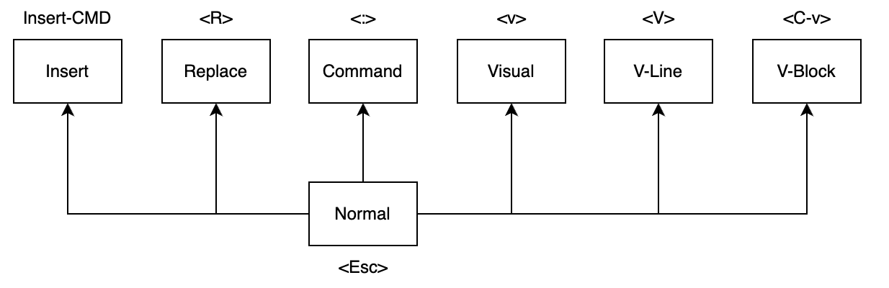
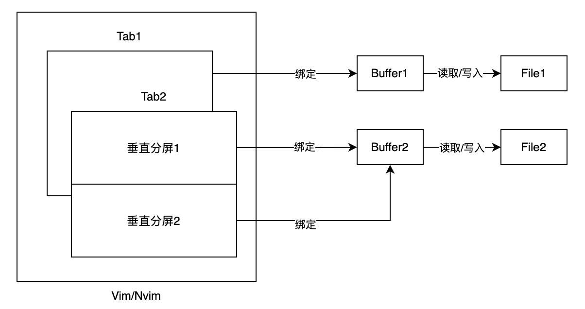

## 1. Vim 与 Neovim

Vim 是一款基于 TUI 的文字编辑器, 由另一种文字编辑器 Vi 改进而来, 其核心特性是只使用键盘就能够完成文字编辑功能, 同时 Vim 提供了语法着色、插件支持等高级编辑功能, 是一种具备高级功能的文字编辑器

[Neovim](https://neovim.io/) 是 Vim 一个重构分支, 在继承并兼容 Vim 常规特性的同时提供了更为现代化的特性, 如内建语言服务器、第一类支持 lua5.1/luajit 作为其配置语言、插件系统、异步系统等等; 在重构后, Neovim 具有相对干净的源代码从而使其易于维护, 同时具有更好的运行效率

```
$ brew install neovim
$ nvim --version
$ nvim									# 从当前 shell-path 进入文本编辑
```

## 2. 操作框架

Vim/Nvim 启动后, 默认处于 Normal 模式, 在任何其他模式下按下 `Esc` 都将返回到 Normal 模式



|    模式     |                 说明                 |
| :---------: | :----------------------------------: |
| **Normal**  |             执行命令操作             |
| **Command** |       内部控制台, 执行控制指令       |
| **Visual**  |    选择连续区域字符, 执行命令操作    |
| **V-Line**  |     选择连续行字符, 执行命令操作     |
| **V-Block** |   选择连续矩形块字符, 执行命令操作   |
|   Insert    |       一般性输入, 在光标处输入       |
|   Replace   | 替换性输入, 从光标处开始替换后续文本 |

**命令操作**: 在非输入模式下, 键盘按键都将视为命令, 不同命令有不同效果, 允许用户自行配置 

```shell
:h[elp] [<string>]						# 打开帮助手册, 或根据输入字符串搜索相关内容
```



**缓冲区**: 一份 Vim/Nvim 文件实质是一片内存, 所有修改都发生在内存上, 执行 **显式写入操作** 后保存修改至硬盘

**窗口屏**: 窗口屏绑定一块缓冲区, 用于对缓冲区内容的展示与编辑, 多个窗口屏可以绑定同一块缓冲区, 自动同步

**选项卡**:选项卡是窗口屏的集合, 选项卡之间相互叠加, 同一时刻只有一个选项卡可视

+ **默认**: 启动 Vim/Nvim 后, 默认打开一个选项卡, 选项卡只有一个窗口屏, 该窗口屏绑定默认缓冲区

| 选项卡 |      控制指令      | 命令 | 说明                                                         |
| :----: | :----------------: | :--: | ------------------------------------------------------------ |
|  新建  | `:tabnew [<file>]` |      | 1. 新建 Tab (1-Win), 载入指定文件, 或创建空缓冲区<br />2. 别名: `:tabe[dit]` |
|  列出  |      `:tabs`       |      | 列出当前所有的 Tab                                           |
|  关闭  |   `:tabc[lose]`    |      | 关闭当前 Tab 以及其拥有的 Win, 不影响缓冲区                  |
|  移动  |    `:tabn[ext]`    | `gt` | 循环下一个                                                   |
|  移动  |  `:tabp[revious]`  | `gT` | 循环上一个                                                   |

| 窗口屏 |       控制指令       |         命令         | 说明                              |
| :----: | :------------------: | :------------------: | --------------------------------- |
|  水平  | `:sp[lit] [<file>]`  |                      | 水平分屏, 默认当前窗口绑定的文件  |
|  水平  |        `:new`        |                      | 水平分屏, 创建空文件              |
|  垂直  | `:vs[plit] [<file>]` |                      | 垂直分屏, 默认当前窗口绑定的文件  |
|  移动  |                      | `C-W + h | j |k | l` | 在同一 Tab 下的窗口屏之间移动光标 |

`:q[uit]`: 关闭当前窗口屏

+ 若当前被关闭的窗口屏为 Tab 的唯一, 则关闭 Tab, 不影响该 Tab 下窗口所创建的缓冲区
+ 若当前被关闭的选项卡为 Vim 的唯一, 则退出 Vim, 退出 Vim 将导致缓冲区被销毁, **此时可能退出失败**

| 缓冲区 |          控制指令           | 命令 |                 说明                 |
| :----: | :-------------------------: | :--: | :----------------------------------: |
|  新建  |      `:edit [<file>]`       |      |  将当前窗口所绑定的缓冲区切换为其他  |
|  列出  | `:buffers`、`:ls`、`:files` |      |         列出当前所有的缓冲区         |
|  关闭  |    `:bd[elete][<file>]`     |      | 关闭当前活动的缓冲区, 或指定的缓冲区 |
|  写入  |         `:w[rite]`          |      |  将当前缓冲区的修改保存到对应文件中  |

+ 关闭缓冲区时, 若缓冲区存在未写入文件的修改, 则 **关闭失败并报错**

```shell
:q[uit]a[ll]								# 关闭选项卡下的所有窗口
```

| 路径控制指令 | 说明                     |
| :----------: | ------------------------ |
|    `:pwd`    | 当前的工作环境的根路径   |
| `:cd <path>` | 改变当前工作环境的根路径 |

**控制指令自动补全**: Vim/Nvim 的 `:` 系列控制指令支持输入时使用 `<Tab>` 进行自动补全

+ **控制指令名称**: 根据当前输入内容自动补全可以匹配的控制指令
+ **文件路径参数**: 基于 **当前工作路径** 或 **缓冲区条目**, 根据当前输入内容自动补全参数

## 3. 基础语法
|  基本元素   | 说明                                                         |
| :---------: | ------------------------------------------------------------ |
| `character` | 字符、数字、汉字等等                                         |
|   `word`    | 1. 无 `blank` 的字符序列, 彼此之间以 `blank` 分隔<br />2. 一个空 `line` 也被视为一个 `word` |
|   `line`    | 以 `\n` 或 `\r\n` 终结的字符序列                             |
| `paragraph` | **开始**: 空 `line` 或文件起始 (包含)<br />**结束**: 空 `line` 或文件终止 (不含) |
|  `cursor`   | 有行位置和列位置, **位于某个字符 之前**, 在宽光标模式下为在某字符之上 |

|   动作   | 动词                                        | 对象名词                           |
| :------: | :------------------------------------------ | ---------------------------------- |
| `h`、`l` | 至 左/右 一字, 不会改变光标的行位置         | 前驱/后驱 一字                     |
| `k`、`j` | 至 上/下 一行, 尽量不变光标的列位置         | 当前行及 上/下 一行                |
|   `w`    | 至 下一个 `word`, 一般单词, 不含标点        | 下一个 `word`                      |
|   `W`    | 至 下一个 `word`, 广义单词, 包含标点        | 下一个 `WORD`                      |
|   `$`    | 至 当前光标所在行最后一个非换行字符         | 当前光标开始直至最后一个非换行字符 |
|   `}`    | 至 下一个段落开头 (一般是最后一个空 `line`) | 当前光标开始直至段末尾             |

+ 上述动作作为动词或对象名词时允许 `<number>motion` 以表示 **多次动作动词** 或 **复数对象名词**

**文本对象名词**: 文本通常是结构化的, 经常被放置在括号、引号等结构中, 部分文本对象如下

```
i<text-object>			# 内部文本对象
a<text-object>			# 外部文本对象
<text-object> ::=
	t |					# XML 闭合标签, 自动匹配对应标签
	( | [ | { | < |		# 各种括号, 右括号等效
	" | ' | `			# 引号
```

| 操作符 (及物动词, 部分) |         语义         | 不及物重复 (操作行) |
| :---------------------: | :------------------: | :-----------------: |
|           `d`           | delete into register |  `dd`, 删除当前行   |
|           `y`           |  yank into register  |  `yy`, 复制当前行   |
|          `gu`           |        变小写        |       `gugu`        |
|          `gU`           |        变大些        |       `gUgU`        |
|           `>`           |        右缩进        |        `>>`         |
|           `<`           |        左缩进        |        `<<`         |

+ `:h operator` 共 16 种操作符, 操作符在及物模式下需要与 **对象名词** 组合使用, 以表示操作的对象

    ```shell
    operator + object				# 操作符 + 文本对象 ( Norml 模式下 )
    ```

| 命令(部分) | 语义                                                         |
| :--------: | ------------------------------------------------------------ |
|  `p`、`P`  | put the text from register **after/before** the cursor       |
|    `u`     | 1. 撤销上一步操作 (一次命令、一轮 `Normal -> Normal` 等)<br />2. 重做上一步撤销: `:red[o]` |
|  `x`、`X`  | 剪切 后驱/前驱 **一字符**, 保存到寄存器中, 等效为 `dl` 和 `dh` |


## 4. 编辑指南

### 4.1 文本导航

> 以下命令均为动作名词, 可以单独作为动词, 也可以作为文本对象名词使用

```shell
h l					# 字符: 左右
k j					# 行间: 上下, 列位置尽量不变
w					# 单词: 下一个
b					# 单词: 上一个
0 $					# 单行: 首尾
^ g_				# 单行: 非空首尾
f{char}				# 单行: 向后直到指定字符 (包含), F 向前
t{char}				# 单行: 向后直到指定字符 (不含), T 向前
{ }					# 段落: 上下
%					# 括号: 至且包含匹配的括号, 左 <-> 右 均可, 光标在括号上
```

```shell
gg H				 # 行间: 直至开始行 (前后都包含, 列位置尽量不变)
G  L				 # 行间: 直至结束行 ( ... )
{n}G				 # 行间: 直至指定的 绝对行号 ( ... )
{n}%				 # 行间: 直至指定的 百分比行号 ( 前包含, 后不包含 )
```

### 4.2 插入模式

**进入插入模式**: `Normal -> Insert`, 执行一些操作, 然后进入插入模式

```shell
i a					# 字符: 当前光标所在字符, 前/后
I A					# 单行: 当前光标所在行, 非空首、换行尾
o O					# 行间: 当前光标所在行, 下/上 插入空行
s					# 修改: cl
S					# 修改: cc ( 不及物重复 )
```

+ **重复输入模式**: 上述指令支持 `{n}cmd`, 在插入模式下输入并 `Esc` 后, 将自动重复输入内容

```shell
c<text-object>		# 修改: 删除指定的文本对象 into register ( 操作符-及物动词 )
C					# 修改: c$
```

### 4.3 寄存器与宏

```shell
:registers			# 列出所有寄存器及其内容
```

```shell
q{register}			# 开始记录, 并保存到指定的寄存器
q					# 停止记录
@{register}			# 执行指定寄存器中保存的宏
```

`.` 重复上次修改操作

```typescript
let one   = "1";				// 光标位于 let 的首字母
let two   = "2";
let three = "3";
/*
	/let<CR>	  匹配后续的 let, 并进入匹配模式
	cwconst<Esc>  修改单词为 const, 退出插入模式
	n			  前往下一个匹配位置
	.			  重复修改操作
 */
```

### 4.4 可视模式

> **核心思想**: 可视模式下能够 **可视地选择文本对象**, 然后直接提供给 **操作符** 进行操作

| 命令 ( Toggle 进入/退出) |     可视模式     |
| :----------------------: | :--------------: |
|           `v`            | 逐 **字符** 可视 |
|           `V`            | 逐 **单行** 可视 |
|         `Ctrl-v`         | 逐 **矩形** 可视 |

**通用编辑流程**: 可视模式下能够 **可视地选择文本对象**, 然后直接提供给 **操作符** 进行操作

```shell
进入可视模式 -> 选定文本 ( Motion ) -> 执行 操作符 命令 -> 自动退出到 Normal
```

**连续多行编辑**: `Ctrl-v` 能够实现有限多行编辑, 其选定区为矩形, **可视为一个大型光标**, 在整体上支持 `Motion`, 另额外支持多行插入模式, **在 `Esc` 退出该插入模式后, 会在每一行重复修改**

```shell
I A					# 大型光标 前/后
c					# 修改
```

TODO 数字、字母增减

```shell
<div id="app-1"></div>
<div id="app-1"></div>
<div id="app-1"></div>
<div id="app-1"></div>
<div id="app-1"></div>		# Ctrl-v -> select -> g Ctrl-a
```

### 4.5 匹配与替换

**智能大小写匹配**: 当匹配内容为全小写时, 不区分大小写; 当匹配模式存在大写字母时, 区分大小写

```shell
:set ignorecase
:set smartcase
```

**模式语法**: 参考正则表达式 

```shell
pattern ::=
	literal					# 直接匹配字面量
|	^pattern				# 位于行首 ( 列位置为1 )
|	pattern$				# 位于行尾
|	\<pattern				# 位于单词开头
|	pattern\>				# 位于单词结尾
|	pattern \| pattern		# \|   或语义
|	\(pattern\)				# \(\) 小括号模式组合
|	pattern\zspattern		# \zs  限定起始模式, 实际匹配后者
|	pattern\zepattern		# \ze  限定结束模式, 实际匹配前者
|	pattern\{num\}			# 重复 num 次
| 	pattern\{num1, num2\}	# 重复 num1 ~ num2 次
|	pattern\{, num\}		# 重复 最多 num 次
| 	pattern\{num, \}		# 重复 最少
| 	pattern*				# 重复 \{0,\}
| 	pattern\+				# 重复 \{1,\}
|	[section]				# 字符组 是: 等效单字符
|	[^section]				# 字符组 非: 等效单字符
|	\d						# 字符组 [0-9]
|	\D						# 字符组 [^0-9]
|	\s						# 字符组 [空白字符]
|	\S						# 字符组 [^空白字符]
|	\w						# 字符组 [0-9a-zA-Z_] 字母、数字、下划线
|	.						# 字符组 任意字符

# 字符组
section	::=	sect			# 若干个连续的 <sect1><sect2>...
sect	::=
	char					# 字符
|	0-9						# 集合: 数字
|	a-z						# 集合: 小写字母
|	A-Z						# 集合: 大写字母
```

#### 4.5.1 匹配

```shell
/{pattern}<CR>				# 光标之后匹配模式
?{pattern}<CR>				# 光标之前匹配模式
```

确认后 **进入并保持** 在该模式匹配的 **待选模式**, 匹配到的字符将 **默认高亮** ( `:nohl[search]` 关闭高亮 )

```shell
n N							# 前往 下/上 一个匹配处 ( 循环移动 )
```

#### 4.5.2 替换

```shell
:{range}s/{pattern}/{new-pat}/[{option}]
```

```shell
range 	::=
	n1,n2					# 绝对行号: n1~n2
|	n,						# 绝对行号: 至当前行
|	n						# 绝对行号: 指定行
|	%						# 整个文件
|   <empty>					# 当前光标所在行
```

+ 默认情况下, 若某行存在多个符合模式的字符串, 则 **只会替换第一个**

`new-pat`: 一般为字面量, 用于替换匹配模式的字符串, 同时提供了一些特殊字符

```shell
\0 &						# 代指 整个匹配模式的字符串
\1 \2 \3					# 使用 \(\) 对模式进行分组后, 所捕获内容以此代指
\U							# 后续内容大写
```

```shell
option	::=
	g						# 替换行中所有的匹配项
|	i						# 不区分大小写
```

### 4.6 全局命令

### 4.7 外部命令

```shell
:!{cmd}
```

### 4.8 自动命令

```shell
:autocmd [group] events pattern [nested] command		# 注册自动命令
```

### 4.9 用户命令

```shell
command!
```

## 5. Nvim 配置

Neovim 配置文件有默认路径（如下），允许通过由环境变量 `XDG_CONFIG_HOME`指向 nvim 路径所在的根路径

```shell
Unix    ~/.config/nvim/init.vim					# init.lua
Windows ~/AppData/Local/nvim/init.vim			# init.lua
```

**`init.vim/init.lua`**: 配置的入口文件，该文件将在启动时被执行，从而对 Nvim 进行用户配置

```
" vimscript 语法拓展
lua <单行脚本>
lua <<EOF
	<多行脚本>
EOF
```

**导入 Lua 脚本**：`require("<div>.<file>")` 或 `require("<div>/<file>")`，导入时，执行且执行一次脚本

## 6. Nvim Lua API

```lua
for i in pairs(_G) do
    print(i)					-- 打印环境中的模块
end
```

```shell
# _G 部分模块
- jit\								# luajit
- vim\
  - regex							# 正则表达式支持
  - loop							# 事件循环
  - api
  - fn								# 内建函数
  - opt								# 通用配置项
  - cmd								# 执行 string: vimscprit
```

### 6.1 配置项

|  子空间   |      说明      |
| :-------: | :------------: |
|  `vim.o`  |      常规      |
| `vim.wo`  |   窗口作用域   |
| `vim.bo`  |  缓冲区作用域  |
|  `vim.g`  |    全局变量    |
| `vim.env` |    环境变量    |
| `vim.opt` | 存放通用配置项 |

## 7. 插件

```
~/.local/share/nvim/site/pack/packer/start				# Unix   插件存放路径
$LOCALAPPDATA/nvim-data/site/pack/packer/start			# Window 插件存放路径
```

### 7.0 插件管理器 packer.nvim

**自动安装**：TODO 脚本化

**手动安装**：克隆 `github: wbthomason/packer.nvim` 项目至插件存放路径

```lua
-- nvim/lua/plugin/init.lua
vim.cmd "packadd packer.nvim"					-- 载入插件管理器
local ok, packer = pcall(require, "packer")		-- 载入 packer
if not ok then
    error("Failed to require Packer")
end
-- 初始化
packer.init {
    git = {
        -- github clone 代理 ghproxy.com
        default_url_format = "https://ghproxy.com/https://github.com/%s",
    },
    display = {
        open_fn = function()
            return require("packer.util").float {
                border = "rounded",
            }
        end
    },
}
-- 声明使用的插件, 插件将被自动安装、更新、卸载
-- use "github-project"
-- 更改 use 后, 需要重启 nvim
-- 移除或注释 use 即视为卸载
return packer.startup(function(use)
    -- Packer.nvim 插件管理器 ( 自己管理自己 )
    use "wbthomason/packer.nvim"
end)
```

该脚本被执行后，有如下命令被注册

```shell
:PackerSync						# 安装、卸载、更新
:PackerUpdate
:PackerCompile
:PackerClean					# 清除不可使用或未使用的插件
```

### 7.1 主题 gruvbox

```lua
-- gruvbox 主题
use {
    "ellisonleao/gruvbox.nvim",
    requires = {"rktjmp/lush.nvim"}
}
```

```lua
vim.opt.background = "dark"
vim.cmd("colorscheme gruvbox")
```

### 7.2 侧边栏文件树 nvim-tree

```lua
-- nvim-tree 侧边栏文件树
use {
    "kyazdani42/nvim-tree.lua",
    requires = 'kyazdani42/nvim-web-devicons',
}
```

需要特殊字体 Nerd-font

### 7.3 缓冲区 Tab bufferline

### 7.4 状态栏 lualine

### 7.5 自动补全 nvim-cmp

```lua
-- 自动补全
use.{
    "hrsh7th/nvim-cmp",
    -- 代码片段引擎
    "hrsh7th/cmp-vsnip",
    "hrsh7th/vim-vsnip",
    -- 补全内容来源
    "hrsh7th/cmp-nvim-lsp",		-- 内置.LSP
    "hrsh7th/cmp-buffer",  		-- 缓冲区内容
}
```

## 8. 语言服务器

```lua
-- LSPconfig
use {
	"neovim/nvim-lspconfig",
    "williamboman/nvim-lsp-installer"
}
```


